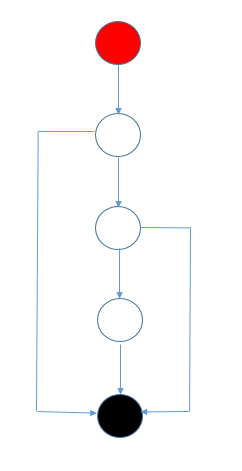

# Задача № 2 "Радиоман"

## Краткое описание

1. Создан maven проект.
2. Перенесен код из лекции 
3. Настроен JaCoCo plugin.
4. Разработаны методы:
    * для управления громкостью 
    * для управления переключением радиостанций 
5. Написаны автотесты на созданные методы, со 100% покрытием по бранчам.

## Примечание

Реализована возможность выбора случайной радиостанции 
перед началом тестов.
 
 # Задача №3 - "Цикломатическая сложность кода"
 
 Основной функционал обработки ```next``` и ```prev``` реализован 
 в сеттере для поля ```setCurrentStation```.
 
 ## Управляющий граф для ```setCurrentStation```
 
 
 
 ## 1. Расчет цикломатической сложности
 
    * Количество ребер (E): 9
    * Количество узлов (N): 8
    * Количество компонент связности (P): 1

    M = E - N + 2P = 9 - 8 + 2 * 1 = 3
    
    Такой же результат получен JaCoCO
    
  ## 2. Рекомендуемый порог цикломатической сложности кода
  
  Цикломатическая сложность метода не должна превышать 10,
  иначе нужно упростить или разбить его.
